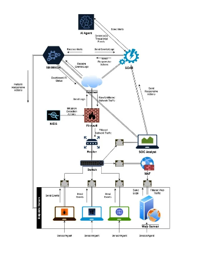
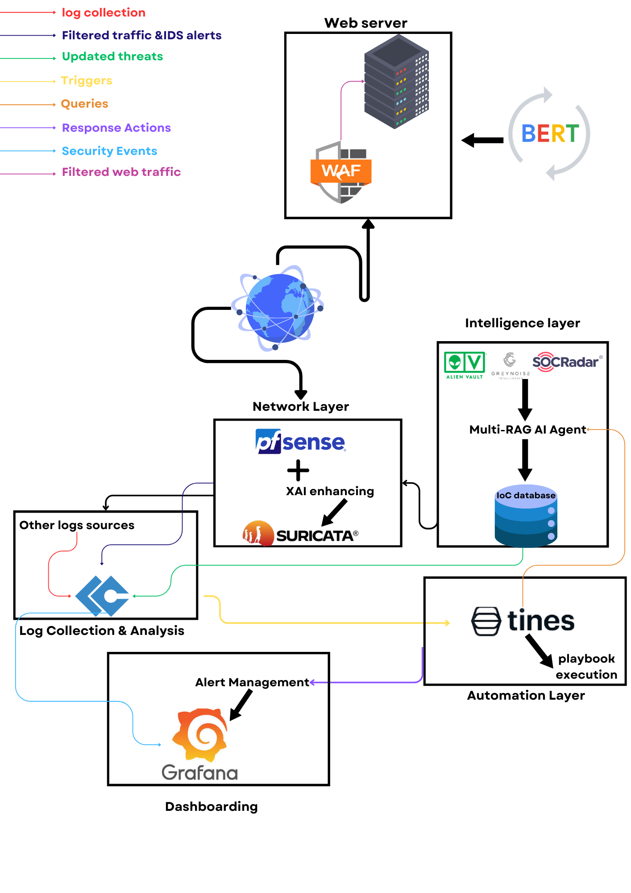

<h1 align="center">
  
```diff
@@  IEEE TSYP 12 CS&YP Technical Challenge  @@
```

# 🛡️ SMARTCHIELD
### *AI-Driven Cybersecurity Incident Response Automation*

<div align="center">
  
  <br/>
  
</div>
</h1>

[](LICENSE)
[](CONTRIBUTING.md)

> An intelligent security operations platform combining BERT-based threat detection with automated response orchestration

## 🌟 Overview

This project implements a comprehensive security operations platform that leverages advanced AI/ML capabilities to enhance traditional security tools. By combining BERT-based models with multi-RAG agent systems and XAI, we create an intelligent security layer that can detect, analyze, and respond to threats in real-time .

## 🏗️ Architecture

Our solution consists of three main components:

### 1. AI Base Layer
- BERT-based threat detection model
- Multi-RAG AI agent for intelligent analysis
- Machine learning pipeline for continuous improvement

### 2. Network Security Layer
- Integration with pfSense for network monitoring
- XAI for enhanced Suricata capabilities
- Advanced Web Application Firewall (WAF) for application security
- LimaCharlie EDR for endpoint detection and response
- Real-time traffic analysis and filtering

### 3. Automation & Response Layer
- Tines playbook execution
- Automated incident response
- Integration with security tools (Alien Vault, SOCRadar)
- IoC database management

  



## 🔧 Components

| Component | Purpose |
|-----------|---------|
| BERT Model | Threat pattern recognition and analysis for web server |
| Multi-RAG Agent | Intelligent decision making and correlation |
| pfSense + SURICATA | Network monitoring and intrusion detection enhanced by XAI |
| WAF | Web application protection and traffic filtering |
| LimaCharlie | Cloud-native EDR and security operations |
| Grafana | Security metrics visualization and alerting |
| Tines | Security automation and orchestration |

## 📊 Data Flow

1. **Collection**: Log sources → pfSense/SURICATA/LimaCharlie
2. **Web Security**: Traffic filtering through WAF
3. **Analysis**: Network data → BERT/Multi-RAG processing
4. **Intelligence**: AI analysis → IoC database
5. **Response**: Automated actions via Tines playbooks
6. **Monitoring**: Real-time visualization in Grafana


## 🚀 Getting Started

### Prerequisites
```bash
# Clone the repository
git clone https://github.com/yourusername/your-repo-name.git

# Navigate to project directory
cd your-repo-name

# Install dependencies
pip install -r requirements.txt
```

### Directory Structure
```
├── AI-base-model/          # Core AI components
├── Bert-based-model/       # BERT implementation
├── Multi-Rag-AI-agent/     # Intelligent agent system
└── README.md              # This file
```

## 🛠️ Configuration

1. Set up your environment variables:
```bash
cp .env.example .env
# Edit .env with your configuration
```

2. Configure your AI models:
```bash
python setup_models.py
```

3. Initialize the security stack:
```bash
docker-compose up -d
```

## 🤝 Contributing

We welcome contributions! Please see our [Contributing Guidelines](CONTRIBUTING.md) for details.


## 🌟 Features

- 🤖 BERT-based threat detection
- 🛡️ Advanced WAF protection
- 🔍 LimaCharlie EDR integration
- 🌐 Real-time network monitoring
- 🔄 Automated response workflows
- 📊 Advanced security analytics
- 🔗 Tool integration ecosystem
- 📈 Performance monitoring

## 🎥 Solution Demo

<div align="center">
  
  [](https://drive.google.com/file/d/1s3CbdC4jHIV3iscPmfKrhXlDuSWvrbYg/view)

  Watch our complete solution demonstration showcasing:
  - 🛡️ Real-time threat detection
  - 🤖 AI-driven analysis
  - 🔄 Automated response system
  - 📊 Live dashboard monitoring

  <i>Click the button above to view the full demonstration</i>
</div>

---
## 🐳 Docker Implementation & API Testing

<div align="center">
  
  [](https://drive.google.com/drive/folders/1_4qUVsulUMQDqO5rVSN8m9A_5hShjbco?usp=sharing)

  ### WAF Enhancement API with DistilBERT
  Ready-to-use Docker image containing our FastAPI implementation of the DistilBERT model for WAF enhancement.
</div>

### 🚀 Quick Start

```bash
# Load the Docker image
docker load < distilbert_waf_api.tar

# Run the container
docker run -d -p 8000:8000 distilbert_waf_api

# Test the API
curl -X POST "http://localhost:8000/predict" \
     -H "Content-Type: application/json" \
     -d '{"text": "your_test_input"}'
```

### 📋 API Endpoints

| Endpoint | Method | Description |
|----------|---------|------------|
| `/predict` | POST | Analyze potential threats using DistilBERT |
| `/health` | GET | Check API health status |
| `/docs` | GET | Interactive API documentation |

### 🔧 Features
- 🚀 FastAPI-powered REST endpoints
- 🤖 DistilBERT model for threat detection
- ⚡ Real-time analysis capabilities
- 📊 Performance metrics
- 🔄 Easy integration with existing WAF

### 📦 Contents
The Docker image includes:
- Optimized DistilBERT model
- FastAPI application
- Required dependencies
- API documentation
- Example test cases

<details>
<summary>💡 Testing Tips</summary>

1. Use the included Swagger UI at `/docs` for interactive testing
2. Check response times for optimization needs
3. Monitor memory usage for production deployment
4. Test with various input patterns
</details>

---

## 📫 Contact

For questions or suggestions, please open an issue or contact the maintainers.

---
<div align="center">
  <i>Made with ❤️ by IEEE ENETCOM Student Branch</i>
</div>
